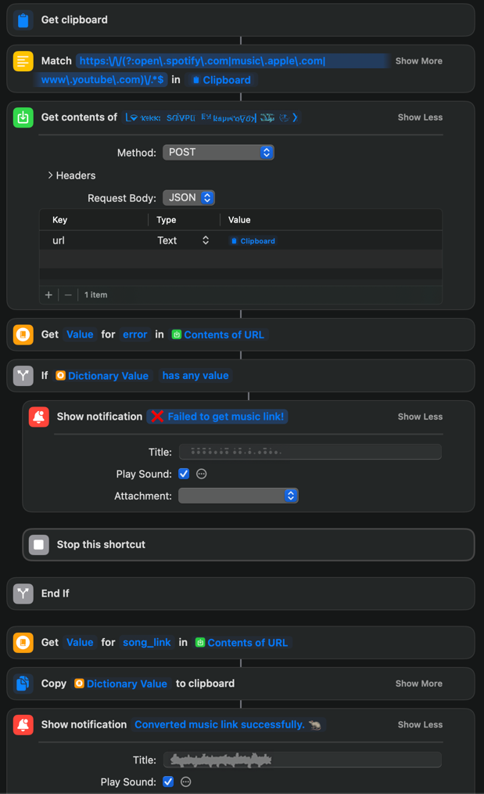

# songlink URL converter
<sub>by [zod](https://github.com/zudsniper)</sub>

## **`DISCLAIMER`**  
This project is **not** affiliated with [song.link](https://song.link)/[odesli.co](https://odesli.co) in any way.  
**Use entirely at your own risk**. I take no responsibility for any consequences of using this project.

---

### Why?
**first**, [songwhip shut down](https://songwhip.com/faq/sunset), so I had to use [song.link](https://song.link) instead.  
**additionally**, this allows for a mildly more convenient way to share music links across platforms programmatically.    

### Structure
This project itself contains a python API that utilizes fairly stupid Selenium automation & stealth to interact with the song.link website.  

> *I'm using this API to create an apple Shortcut for use on iOS & Mac.*  
>   

### Usage
very easy to run. You can literally just `python app.py` and it will work.  
I use `gunicorn` to run this on a server. See `Procfile` for the production deployment information.  

### Deployment
I'm deploying to Heroku for this.  
The CLI took is pretty good, that is how I deployed. **Make sure that's installed**.

```bash
$ heroku login # login to your account
$ heroku create <app-name> # create a new app
$ heroku buildpacks:add --index 1 heroku/python -a <app-name> # add python buildpack
$ heroku buildpacks:add --index 2 https://github.com/heroku/heroku-buildpack-chrome-for-testing -a <app-name> # add chrome + selenium buildpack
$ cd <project-dir> && git init && git add . && git commit -m "initial commit" # initialize git repo
$ heroku git:remote -a <app-name> # configure git remote
$ git push heroku master # deploy
```

#### Environment Variables
- `HEADLESS` -> `True` or `False`   
    If Selenium runs headless or not. **Will break if `False` on Heroku**.  
- `DEPLOYMENT` -> `heroku` or `local`  
    If configuration (mostly the binary & chromedriver paths) should be set for Heroku according to the buildpacks or assume these are set. (local environment)  

#### Buildpacks
This is the heroku buildpack structure being used for this project.  
- [`heroku-buildpack-chrome-for-testing`](https://github.com/heroku/heroku-buildpack-chrome-for-testing)
- `heroku/python`

## API Endpoints
There is 1 endpoint for this API at the moment.  
> _I sort of want to add a playlist processing endpoint to this project, but for some FUCKING reason you can't generate Apple Music playlists programmatically using an OAuth'd application, you need an app... Thanks Tim Cook_
  
### `POST` `/convert`
#### Request
_(in `httpx` format)_
```http request
POST https://{url:port}/convert
Accept: application/json
Content-Type: application/json

{
    "url":"{music-service-url}"
}
```  
#### Response
```json
{
  "song_link": "https://song.link/s/{song-id}"
}

```

## Ok thanks bye 🐀

